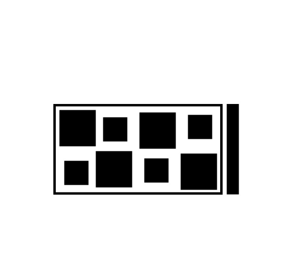

# toy decoder
rotation invariant toy decoder for codes in this style:  

<p float="left">
  
</p>

#### Properties
* thick bar used to calculate absolute rotation
* x,y coordinate encoding: 
  * binary representation: big rects represent 1s, small rects represent 0s
  * Once properly rotated (thick bar in the east), rects above middle line represent x coordinate, below y coordinate

#### Install
```bash
git clone https://github.com/juliangaal/toy_decoder/
cd toy_decoder && mkdir build && cd build
cmake -DCMAKE_BUILD_TYPE=Release .. && make
```
setting `-DAUTO_TEST=ON` will run unit test on every build

#### Use with cmake
```cmake
cmake_minimum_required(VERSION 3.1)
project(test)

find_package(ToyDecoder REQUIRED)

set(CMAKE_CXX_STANDARD 11)

add_executable(import_test main.cpp)
target_link_libraries(import_test PRIVATE ToyDecoder::toy_decoder)
```

Build [](https://circleci.com/gh/juliangaal/hw/tree/master) for ubuntu 16.04, run the [installation script](./install.sh) to install all necessary components
