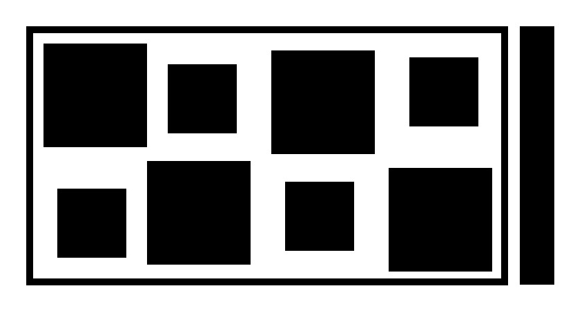

# toy decoder
rotation invariant toy decoder for codes in this style:  

<p float="left">
  
</p>

#### Properties
* thick bar used to calculate absolute rotation
* x,y coordinate encoding: 
  * binary representation: big rects represent 1s, small rects represent 0s
  * Once properly rotated (thick bar in the east), rects above middle line represent x coordinate, below y coordinate

#### Dependencies
* OpenCV 4.0
* [fmt](https://github.com/fmtlib/fmt)
* [Catch](https://github.com/catchorg/Catch2)

Build [](https://circleci.com/gh/juliangaal/hw/tree/master) for ubuntu 16.04, run the [installation script](./install.sh) to install all necessary components, if they aren't on your system

#### Install
```bash
git clone https://github.com/juliangaal/toy_decoder/
cd toy_decoder && mkdir build && cd build
cmake -DCMAKE_BUILD_TYPE=Release ..
make && sudo make install
```
setting `-DAUTO_TEST=ON` will run unit test on every build

### Use
Manual mode
```cpp
#include <fmt/format.h>
#include <toy_decoder/toy_decoder.hpp>

int main(void) {
    cv::Mat im = cv::imread("file.jpg", cv::IMREAD_GRAYSCALE);
    ToyDecoder decoder(im);
    
    float orientation;
    cv::Point2i decoded_point;
    bool result;
    
    decoder.calculate_keypoints();
    std::tie(orientation, result) = decoder.calculate_orientation();
    if (!worked)
        return 1;

    decoder.rotate_keypoints(util::units::Degrees(orientation));
    std::tie(decoded_point, worked) = decoder.decode();
    if (!worked)
        return 1;
    
    fmt::print("Rotation: {}\n", orientation);
    fmt::print("Decoded: ({},{}), result: {}\n", decoded_point.x, decoded_point.y, worked);
} 
```

#### Use with cmake
```cmake
cmake_minimum_required(VERSION 3.1)
project(test)

find_package(ToyDecoder REQUIRED)

set(CMAKE_CXX_STANDARD 11)

add_executable(main main.cpp)
target_link_libraries(main PRIVATE ToyDecoder::toy_decoder)
```
