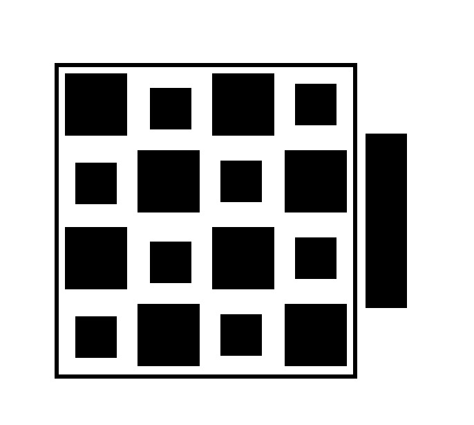

# Not QR Code 

<br>

### Properties
* thick bar used to calculate absolute rotation
* x,y coordinate encoding: 
  - binary representation: big rects represent 1s, small rects represent 0s
  - Once properly rotated (thick bar in the east), rects above middle line represent x coordinate, below y coordinate
* e.g. the picture above will decode to orientation: 0, coordinate: (165, 165)

## Demo


#### Dependencies
* OpenCV 3.0
* [fmt](https://github.com/fmtlib/fmt) (for tests, examples)
* [Catch](https://github.com/catchorg/Catch2) (for tests)

#### Requirements
* cmake 3.0+
* tested with clang 7, 8 and g++ 7 - 9. Any c++14 compatible compiler should work.

#### Install
```bash
git clone https://github.com/juliangaal/notqrcode/
cd notqrcode && mkdir build && cd build
cmake -D CMAKE_BUILD_TYPE=Release ..
make && sudo make install
```

#### CMake Options
* `-D COMPILE_TESTS=ON` (default `OFF`) will compile tests and expose target `test` in the cmake Makefile. You can then either run `make test` in the build directory, or `ctest --verbose` for verbose output in case of test failures.
* `-D ENABLE_AUTO_TEST=ON` (default `OFF`) will run unit test on every build, if enabled with above command
* `-D COMPILE_EXAMPLES=ON` (default `OFF`) will compile examples in `examples` directory

#### Usage

You can generate docs with `make doc` in the build directory. Also, examples are provides in the `examples` folder:

* `video.cpp` runs the decoder on incoming video data, continuously
* `file.cpp` runs the decoder on file path argument
* `img.cpp` runs the decoder on existing `cv::Mat`

#### Use with cmake
```cmake
cmake_minimum_required(VERSION 3.1)
project(test)

find_package(NotQRCode REQUIRED)
find_package(OpenCV 3.0 REQUIRED)

set(CMAKE_CXX_STANDARD 11)

add_executable(main main.cpp)
target_link_libraries(main PRIVATE NotQRCode::notqrcode ${OpenCV_LIBS})
```
